# swarmbots

Simulación de **swarm robotics** sobre **ROS 2 Jazzy** + **Gazebo Harmonic**: un enjambre de **Summit XLS omnidireccionales (mecanum) con pinza y cámara RGB-D** que recoge basura y la lleva al depósito de su color. El objetivo final es grabar demostraciones y entrenar una política **ACT** (Action Chunking Transformer, imitation learning) que haga la tarea sola.

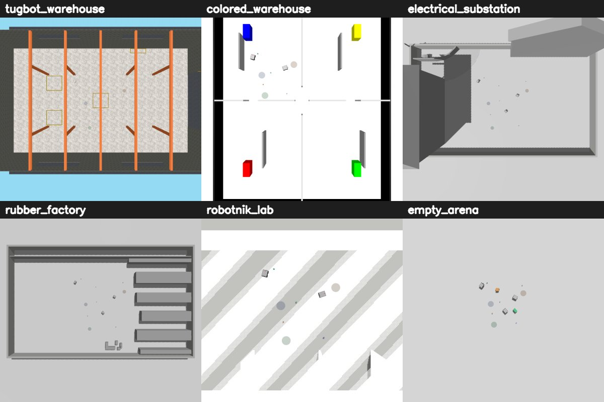

## Estado

| Pieza | Estado |
|---|---|
| Migración Humble/Fortress → Jazzy/Harmonic | ✅ validada en vivo (Gazebo 8.11, RTF ≈ 1.0) |
| Escenario aleatorio con semilla (robots, basura, depósitos) | ✅ validado en vivo |
| Ciclo de recogida clásico (planner greedy + RGB-D + `DetachableJoint`) | ✅ validado en `tugbot_warehouse` (1 robot 6/6, 3 robots 6/6, 0 colisiones) |
| Clasificación por color, anti-arrastre, turno de descarga por depósito | ✅ validados en vivo (`color OK 4/4`, 0 colisiones) |
| Set de **6 mundos** para variar el dataset | ✅ cargan sin errores, RTF 0.85–1.0, cámaras revisadas |
| Ciclo completo con métricas en los 5 mundos nuevos | ⏳ pendiente |
| El ciclo de dejado a veces se traba (reportado en vivo) | 🐛 abierto |
| Pipeline rosbag → HDF5 para ACT | ✅ validado con test sintético; falta un bag real |
| Grabar demostraciones y entrenar el ACT | ⏳ siguiente paso |
| Drones X3 | 💤 aparcados (`n_drones:=0` por defecto; el código sigue) |

## Qué incluye

- **Summit XLS mecanum** (`summit0…N-1`): cinemática omnidireccional real (física, no bypass) con `MecanumDrive` + fricción direccional `fdir1` inyectada en el SDF. LiDAR 2D, IMU, odometría ground-truth y de encoders, joint states.
- **Pinza paralela + cámaras**: pinza de 2 dedos fija al frente (solo abre/cierra, la pieza viaja a ras de suelo), cámara RGB frontal (`/summitN/camera`) y cámara de profundidad co-localizada (`/summitN/camera/depth`). Control de los dedos con `gz_ros2_control`.
- **Escenario aleatorio reproducible**: robots (posición y yaw), cajas de basura de 3 colores y depósitos del mismo color, con `seed` (`-1` = distinto cada vez).
- **Ciclo de recogida autónomo** (`swarm_behavior`): planner centralizado greedy, navegación por campos potenciales que aprovecha el strafe, aproximación final por profundidad y agarre físico con `DetachableJoint` confirmado por ACK.
- **6 mundos** vendorizados (sin Fuel ni internet), todos con la misma cámara cenital `/overhead/image`.
- **Teleop con mando PS5** y **conversor rosbag → HDF5** en el formato de ACT/ALOHA.
- Herramientas de geometría: mapas occupancy/vectoriales de cada mundo, medición del hueco libre y recorte de mundos.

## Los mundos

Todos comparten nombre interno `world_demo` (salvo `empty_arena`), física `max_step_size=0.004`, los plugins Harmonic (`Sensors`, `Imu`, …) y una cámara cenital, para que el dataset salga homogéneo. Ninguno tiene techo: la cenital debe ver el suelo.

| Mundo | Entorno | `center_x`, `center_y` | `area_half` |
|---|---|---|---|
| `tugbot_warehouse` (defecto) | almacén vaciado 30×50 m | 0, 0 | 8 |
| `colored_warehouse` | 4 cuadrantes con estanterías de color | **4.2, 4.2** | **3.5** |
| `electrical_substation` | exterior, recortado a 30×50 m | 0, 0 | 8 |
| `rubber_factory` | nave industrial, recortada a 30×50 m | 0, 0 | 8 |
| `robotnik_lab` | oficina con 43 puestos | **3.7, −19.0** | **4.5** |
| `empty_arena` | control sin distractores | 0, 0 | 4 |

> ⚠️ En `colored_warehouse` y `robotnik_lab` el centro y el `area_half` **no son opcionales**: la colocación aleatoria no esquiva la geometría del mundo, y con el centro por defecto los robots nacen dentro de una pared. Los valores de la tabla son huecos libres medidos con `scripts/world_maps.py`.

Capturas de la simulación (izquierda: cámara cenital `/overhead/image`; derecha: cámara frontal del robot `/summit0/camera`).

### `tugbot_warehouse`
<p>
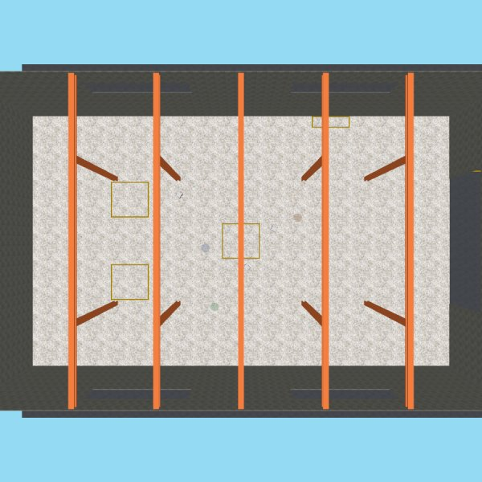
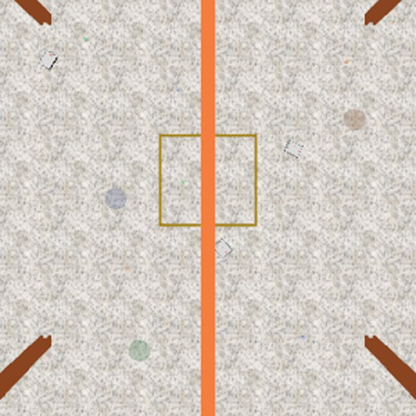
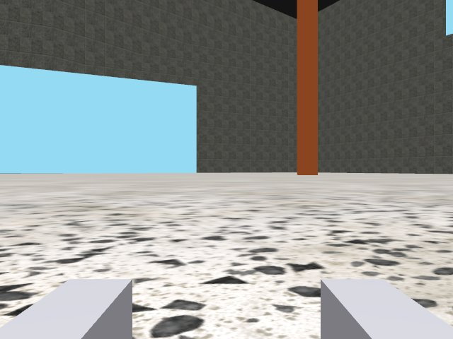
</p>

Almacén del Tugbot de MovAi con los obstáculos quitados: queda el edificio, sus paredes y el suelo libre. En el detalle del centro se ven los 3 robots, las cajas y los discos de depósito.

### `colored_warehouse`
<p>
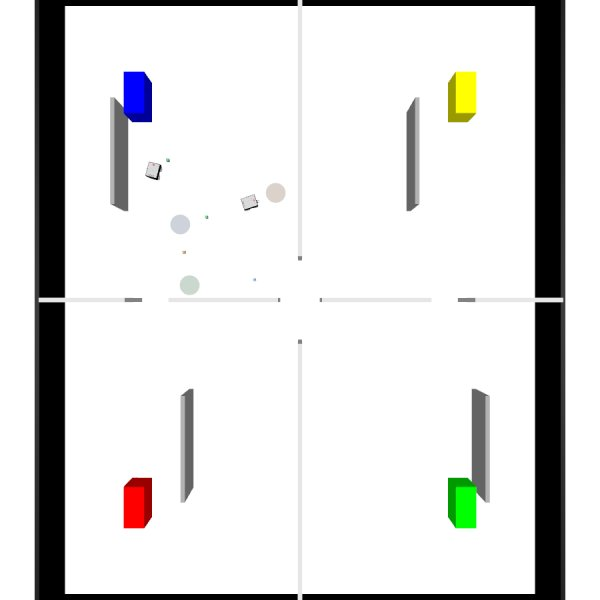
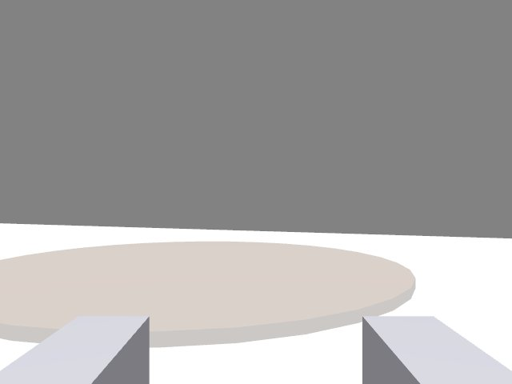
</p>

Fuel `hboc/simple_colored_warehouse`: cuatro cuadrantes con estanterías de colores. El escenario se coloca dentro de un cuadrante (el hueco libre medido).

### `electrical_substation`
<p>
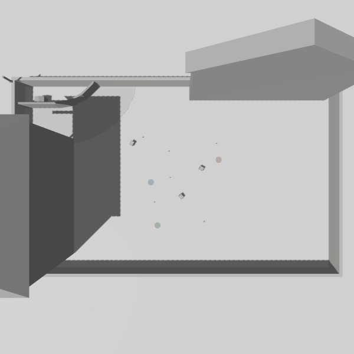
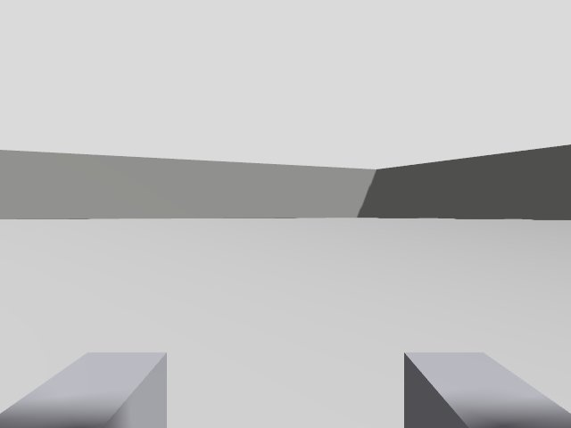
</p>

Exterior de Robotnik, recortado a 30×50 m con `crop_world.py`. En el recorte se quitó un plano de colisión infinito (el marcador AR de la estación de carga) que actuaba de muro invisible y bajaba el RTF.

### `rubber_factory`
<p>
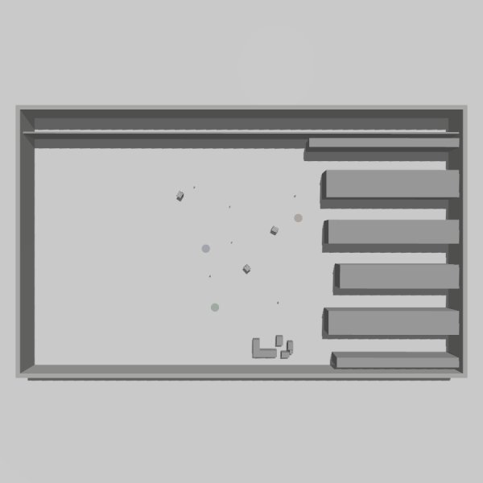
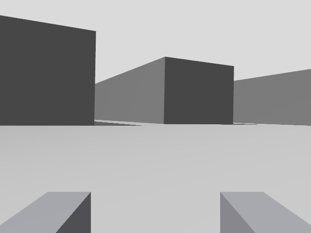
</p>

Nave industrial `emka_factory` de Robotnik, recortada a 30×50 m: nave abierta con una fila de máquinas.

### `robotnik_lab`
<p>
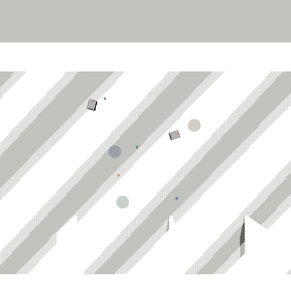
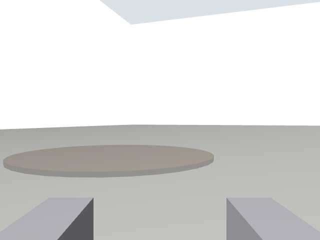
</p>

Oficina/laboratorio de Robotnik, el entorno más abarrotado. Las rayas de la cenital son z-fighting entre el plano de suelo y el suelo de la malla (conocido, se dejó así).

### `empty_arena`
<p>
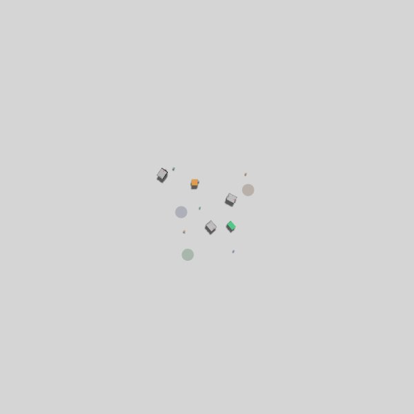
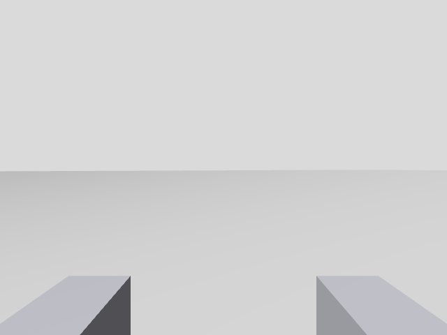
</p>

Arena vacía de control. Su `<world>` se llama `empty_arena`, así que el ciclo de recogida necesita `world:=empty_arena`.

## Requisitos

- Ubuntu 24.04 con ROS 2 Jazzy, Gazebo Harmonic (`gz sim` 8.x), `ros-jazzy-ros-gz*`, `ros-jazzy-xacro`, `ros-jazzy-gz-ros2-control`, `ros-jazzy-ros2-controllers`
- GPU NVIDIA recomendada (`gpu_lidar` y cámaras rinden mucho mejor)
- Alternativa portable: Docker + NVIDIA Container Toolkit (ver `swarm_ws/docker/`)

## Uso rápido

```bash
cd swarm_ws && source /opt/ros/jazzy/setup.bash
colcon build --symlink-install
source install/setup.bash

# Terminal 1: mundo con 3 Summit, pinzas, 6 basuras y 3 depósitos
ros2 launch swarm_worlds sim_summit.launch.py n_robots:=3

# Terminal 2: ciclo de recogida autónomo
ros2 launch swarm_behavior swarm_collect.launch.py n_robots:=3
```

Otro mundo (con su centro y su hueco medidos):

```bash
ros2 launch swarm_worlds sim_summit.launch.py world:=colored_warehouse \
  n_robots:=2 n_trash:=4 center_x:=4.2 center_y:=4.2 area_half:=3.5
ros2 launch swarm_behavior swarm_collect.launch.py n_robots:=2
```

Argumentos de `sim_summit.launch.py`:

| Argumento | Por defecto | Descripción |
|---|---|---|
| `n_robots` | `3` | Nº de Summits |
| `world` | `tugbot_warehouse` | Mundo (ver tabla de mundos) |
| `n_trash` | `6` | Nº de cajas de basura (colores cíclicos verde/azul/naranja) |
| `n_deposits` | `3` | Nº de depósitos (`3` = uno por color, `6` = dos por color) |
| `center_x` / `center_y` | `0` / `0` | Centro de la zona de aparición |
| `area_half` | `8` | Semilado de la zona de aparición |
| `seed` | `42` | Semilla del escenario (`-1` = distinto cada vez) |
| `gripper` | `true` | Pinza + cámaras RGB y de profundidad |
| `n_drones` | `0` | Drones X3 (`-1` = igual que `n_robots`) |
| `headless` | `false` | Servidor sin GUI (usa `--headless-rendering`) |

Mover un robot a mano:

```bash
ros2 topic pub /summit0/cmd_vel geometry_msgs/Twist '{linear: {x: 0.3, y: 0.2}}'   # avance + strafe
ros2 topic pub /summit0/cmd_vel geometry_msgs/Twist '{}'                            # frenar (los comandos persisten)
ros2 topic pub --once /summit0/gripper/grasp   std_msgs/msg/Empty '{}'
ros2 topic pub --once /summit0/gripper/release std_msgs/msg/Empty '{}'
```

## Ciclo de recogida

Cada robot recorre `seek → align → grasp → deliver → release → seek`, y cada transición espera una confirmación real:

1. **`central_planner`** lee las poses ground-truth de Gazebo y asigna a cada robot libre la basura más cercana sin reclamar.
2. **`go_to_goal`** navega por campos potenciales (atracción + repulsión del LiDAR) usando el strafe del mecanum para esquivar; es el único publicador de `cmd_vel`.
3. Cerca de la pieza, **`visual_grasp`** toma el control con la cámara de profundidad: centra la caja por strafe y la mete entre los dedos en dos tramos (rápido lejos, lento en la inserción).
4. **`grasp_manager`** cierra los dedos y crea el `DetachableJoint` en la pose que la pieza ya ocupa, sin teletransporte, reintentando hasta recibir `attached`.
5. El planner manda la pieza al **depósito de su color**. Mientras transporta, publica las demás piezas como repulsores virtuales (el LiDAR va a 0.56 m y no ve las cajas de 0.20 m) para no barrerlas.
6. Solo un robot suelta a la vez en cada depósito; los demás esperan fuera del alcance de su LiDAR. Al recibir `detached` el robot retrocede en recto y pide otra tarea.

Métricas al terminar: piezas recogidas, aciertos de color, makespan y colisiones robot-robot.

```text
Pieza centrada por RGB-D
CERRANDO sobre 'trash_N'
JOINT CONFIRMADO para 'trash_N'
DETACH CONFIRMADO para 'trash_N'; pieza libre en deposito
```

## Datos para ACT

Teleop con mando PS5 para grabar demostraciones:

```bash
ros2 launch swarm_behavior teleop_ps5.launch.py robot:=summit0 [frame:=body]
```

Conversión de cada rosbag a un episodio HDF5 con las claves de ACT/ALOHA (`/observations/qpos`, `/observations/images/{front,overhead}`, `/action`):

```bash
python3 swarm_ws/scripts/bag_to_act_hdf5.py demo_143052 -o episode_0.hdf5
python3 swarm_ws/scripts/bag_to_act_hdf5.py demo_143052 -o ep.hdf5 --debug_dump_frames 5   # revisar cámaras
```

Por defecto: `qpos = [yaw, ancho_pinza]` (egocéntrico, para una política compartida entre robots), `action = [vx, vy, wz, grasp]` (holonómica), 15 Hz.

## Herramientas de mundo

```bash
/usr/bin/python3 swarm_ws/scripts/world_maps.py --write   # mapas occupancy + vectoriales en swarm_worlds/maps/ y hueco libre medido
/usr/bin/python3 swarm_ws/scripts/crop_world.py <mundo> --center X Y --size 30 50 [--rotate90]   # recorta a una ventana y cierra con paredes
```

`world_geometry.py` carga toda la colisión y el visual de un SDF en frame mundo (poses 6D, STL, COLLADA, primitivas, actores), y los otros dos scripts se apoyan en él.

## Demos anteriores (siguen en el código)

- **Drones X3** que despegan solos y hacen hover sobre los Summits (`n_drones:=-1`).
- **Comportamiento de enjambre + RViz**: un "2D Goal Pose" mueve a todos los robots, en anillo o en líder-seguidor (`swarm_behavior.launch.py`, `rviz.launch.py`).
- **Grupos {Summit + dron}** a metas aleatorias con cesión de paso por prioridad (`swarm_pairs.launch.py`).
- Summit XL skid-steer individual (`spawn_summit.launch.py`) y enjambre de minibots (`sim.launch.py`).


## Estructura

```
swarm_ws/
├── docker/                      # Dockerfile + compose (respaldo de portabilidad)
├── scripts/                     # sim_native.sh, bag_to_act_hdf5.py, world_geometry/world_maps/crop_world.py
└── src/
    ├── swarm_worlds/            # 6 mundos, launches, mapas, modelos vendorizados
    ├── swarm_behavior/          # planner, navegación, agarre RGB-D, pinza, teleop PS5, drones, RViz
    ├── swarm_description/       # minibot diff-drive
    ├── summit_xl_description/   # Summit XLS mecanum + pinza + cámaras, portado a Harmonic
    └── robotnik_*/              # paquetes externos Robotnik
docs/img/worlds/                 # capturas de los mundos
```

Decisiones de diseño, mediciones y lecciones aprendidas en [CLAUDE.md](CLAUDE.md).
