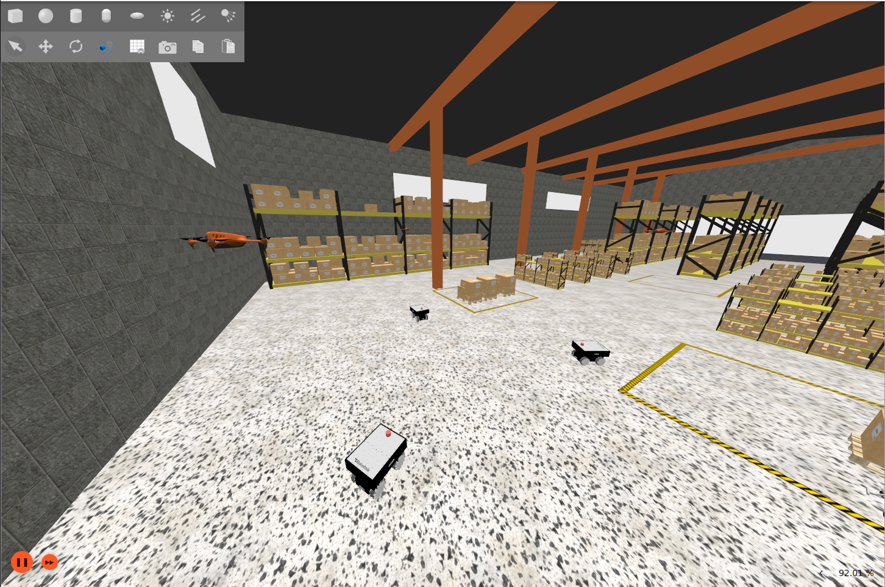

# swarmbots

Simulación de **swarm robotics** sobre **ROS 2 Jazzy** + **Gazebo Harmonic**: un enjambre de N **Summit XLS omnidireccionales (mecanum)** patrullando un almacén, sobrevolado por N **drones X3** que despegan solos y quedan en hover.

> Migrado de Humble/Fortress a Jazzy/Harmonic a nivel de código (2026-06-25); pendiente de validación end-to-end en vivo (requiere instalar `gz-harmonic` + `ros-jazzy-ros-gz*` en la máquina).



## Qué incluye

- **Mundo warehouse** (`tugbot_warehouse`, por defecto): almacén MovAi con estanterías, carros, pallets y estación de carga. El edificio está vendorizado con colisiones primitivas para mantener RTF ≈ 1.
- **Summit XLS mecanum** (`summit0…N-1`): cinemática omnidireccional real (física, no bypass) con `MecanumDrive` + inyección de fricción direccional `fdir1` en el SDF. LiDAR 2D, odometría y joint states por robot.
- **Drones X3** (`drone0…N-1`): quadrotor vendorizado con `MulticopterVelocityControl`; despegue automático por altitud real y hover estable ~3.5 m sobre el anillo de summits.
- **Comportamiento de enjambre** (`swarm_behavior`): un mismo destino mueve **summits y drones**. Los summits hacen go-to-goal reactivo con evasión de obstáculos por LiDAR (campos potenciales, aprovecha el strafe mecanum) y modo líder-seguidor; los drones vuelan al mismo punto a su altitud de crucero (capas de altura por dron para no colisionar). Destino fijado en vivo desde RViz con la herramienta "2D Goal Pose", sobre un mapa estático del almacén.
- Variantes secundarias: Summit XL skid-steer individual, enjambre de minibots y mundo `empty_arena`.

## Requisitos

- Ubuntu 24.04 con ROS 2 Jazzy, Gazebo Harmonic (`gz sim` 8.x) y `ros-jazzy-ros-gz*`
- GPU NVIDIA recomendada (los `gpu_lidar` rinden mucho mejor)
- Alternativa portable: Docker + NVIDIA Container Toolkit (ver `swarm_ws/docker/`)

## Uso rápido

```bash
./swarm_ws/scripts/sim_native.sh 3      # build + warehouse con 3 summits y 3 drones
```

Equivale a:

```bash
cd swarm_ws && source /opt/ros/jazzy/setup.bash
colcon build --symlink-install --packages-up-to swarm_description swarm_worlds summit_xl_description
source install/setup.bash
ros2 launch swarm_worlds sim_summit.launch.py n_robots:=3
```

Mover robots (en otra terminal, tras los mismos `source`):

```bash
ros2 topic pub /summit0/cmd_vel geometry_msgs/Twist '{linear: {x: 0.3, y: 0.2}}'   # avance + strafe
ros2 topic pub /drone0/cmd_vel  geometry_msgs/Twist '{linear: {x: 0.3}}'           # dron (frame del cuerpo)
ros2 topic pub /summit0/cmd_vel geometry_msgs/Twist '{}'                            # frenar (los comandos persisten)
```

Argumentos útiles del launch:

| Argumento | Por defecto | Descripción |
|---|---|---|
| `n_robots` | `3` | Nº de Summits |
| `n_drones` | `-1` | Nº de drones (`-1` = igual que `n_robots`) |
| `world` | `tugbot_warehouse` | Mundo (`empty_arena` disponible) |
| `center_x` / `center_y` | `0` / `18` | Centro del círculo de spawn |
| `headless` | `false` | Servidor sin GUI (usa `--headless-rendering`) |

## Comportamiento de enjambre + RViz

Con la sim ya corriendo, en otras dos terminales (tras los mismos `source`):

```bash
# Controladores: todos los summits van al mismo punto y esquivan obstáculos
ros2 launch swarm_behavior swarm_behavior.launch.py n_robots:=3 goal_x:=0.0 goal_y:=8.0
# …o modo líder-seguidor (summit0 va al punto, el resto le siguen):
ros2 launch swarm_behavior swarm_behavior.launch.py n_robots:=3 mode:=follow

# RViz con el mapa del almacén y control interactivo del destino
ros2 launch swarm_behavior rviz.launch.py n_robots:=3
```

En RViz pulsa **"2D Goal Pose"** y clica en el mapa para fijar el destino del enjambre en vivo. El mapa estático se genera sin simular con `python3 swarm_ws/scripts/make_warehouse_map.py` (rasteriza las colisiones del mundo a un occupancy grid).

## Recogida autónoma de basura

La simulación puede generar cajas de basura y equipar cada Summit con pinza y
cámara RGB-D. El ciclo de recogida usa navegación global con LiDAR, aproximación
visual final y un `DetachableJoint` oficial de Gazebo para transportar la pieza
sin llamadas a `set_pose` ni teletransporte.

```bash
# Terminal 1: mundo con tres Summit, pinzas, basura y depósitos
source install/setup.bash
ros2 launch swarm_worlds sim_summit.launch.py n_robots:=3

# Terminal 2: asignación, navegación, alineación RGB-D y agarre
source install/setup.bash
ros2 launch swarm_behavior swarm_collect.launch.py n_robots:=3
```

Secuencia de seguridad por pieza:

1. La pinza permanece completamente abierta durante la aproximación.
2. La cámara de profundidad centra e introduce la caja lentamente entre los dedos.
3. Los dedos cierran primero y el joint se adjunta conservando la pose física actual.
4. El planner no inicia el transporte hasta recibir la confirmación `attached`.
5. En el depósito el robot se detiene, abre la pinza y repite `detach` hasta recibir
   `detached`; solo entonces retrocede y acepta una tarea nueva.

Mensajes esperados en una recogida correcta:

```text
Pieza centrada por RGB-D
CERRANDO sobre 'trash_N'
JOINT CONFIRMADO para 'trash_N'
DETACH CONFIRMADO para 'trash_N'; pieza libre en deposito
```

Para probar manualmente el mecanismo:

```bash
ros2 topic pub --once /summit0/gripper/grasp std_msgs/msg/Empty '{}'
ros2 topic pub --once /summit0/gripper/release std_msgs/msg/Empty '{}'
```

### Grupos {Summit + dron} a metas aleatorias (con cesión de paso)

**N grupos** (`n_groups`), cada uno con **n pares** Summit+dron (`pairs_per_group`), cada grupo a su **propia meta aleatoria**. Dentro de un grupo los Summits forman un anillo alrededor de la meta y los drones la sobrevuelan en capas; si las rutas de dos grupos se cruzan, el de menor prioridad **se aparta** para ceder el paso. **La sim debe tener `n_robots = n_groups × pairs_per_group`.**

```bash
# 2 grupos de 1 par (4 robots)
ros2 launch swarm_worlds sim_summit.launch.py n_robots:=2
ros2 launch swarm_behavior swarm_pairs.launch.py n_groups:=2 pairs_per_group:=1  # [seed:=3]

# 2 grupos de 2 pares (8 robots: 4 summits + 4 drones)
ros2 launch swarm_worlds sim_summit.launch.py n_robots:=4
ros2 launch swarm_behavior swarm_pairs.launch.py n_groups:=2 pairs_per_group:=2
```

## Tópicos por robot

`/<ns>/cmd_vel`, `/<ns>/odom`, `/<ns>/scan` (solo summits), `/<ns>/joint_states`, `/<ns>/tf` — con `<ns>` = `summit0…`, `drone0…`.

## Estructura

```
swarm_ws/
├── docker/                      # Dockerfile + compose (respaldo de portabilidad)
├── scripts/                     # sim_native.sh (primario), make_warehouse_map.py, build/run/sim.sh (Docker)
└── src/
    ├── swarm_worlds/            # mundos, launches del enjambre, mapas, modelos vendorizados (X3, warehouse)
    ├── swarm_behavior/          # navegación, recogida RGB-D, pinza, drones y RViz
    ├── swarm_description/       # minibot diff-drive
    ├── summit_xl_description/   # Summit portado a Harmonic (omni + skid-steer)
    └── robotnik_*/              # paquetes externos Robotnik
```

Más detalle técnico (decisiones de diseño, lecciones aprendidas) en [CLAUDE.md](CLAUDE.md).
